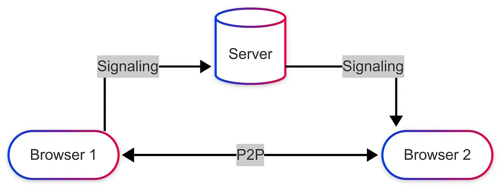

# 🛰️ WebRTC Signaling Server (Go)

A lightweight, high-performance **WebSocket signaling server** built in **Golang** for managing peer connections in a WebRTC-based video calling system.

This backend is designed to work seamlessly with a React-based WebRTC frontend for **real-time peer-to-peer (P2P) video, audio, and data communication**.

---

## ⚡ Features

✅ Handles multiple rooms with up to 2 users each  
✅ Supports secure WebSocket signaling (WSS / WS)  
✅ Auto-cleans inactive rooms and idle connections  
✅ Includes `/healthz` and `/metrics` endpoints  
✅ Graceful shutdown with cleanup  
✅ Works perfectly with STUN/TURN servers for NAT traversal  
✅ Modular structure (`main.go`, `config.go`, `logger.go`)  

---

## 🏗️ Tech Stack

| Component | Technology |
|------------|-------------|
| Language | Go (Golang 1.20+) |
| WebSocket | Gorilla WebSocket |
| Logging | Logrus |
| Env Management | godotenv |
| Frontend Compatibility | React, Vanilla JS, WebRTC APIs |

---
## 🌐 Project Links
- 🖥️ **Backend Repository:** [voip_server](https://github.com/Rohit175041/voip_server)
- 💻 **Frontend Repository:** [lan-voip](https://github.com/Rohit175041/lan-voip)
- 🚀 **Live Demo:** [lan-voip.onrender.com](https://lan-voip.onrender.com)

## 📡 WebRTC P2P Architecture
<p align="center">
  
</p>

## 🚀 Quick Start

### 1️⃣ Clone the repository

```bash
git clone https://github.com/Rohit175041/voip_server.git
cd voip_server
